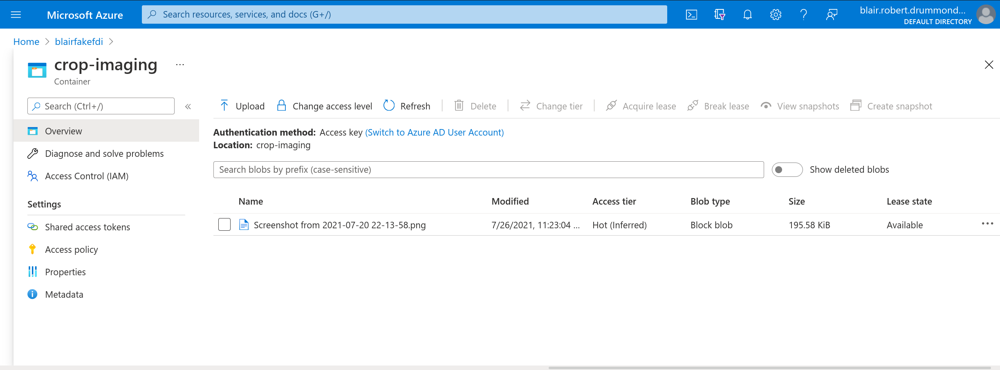
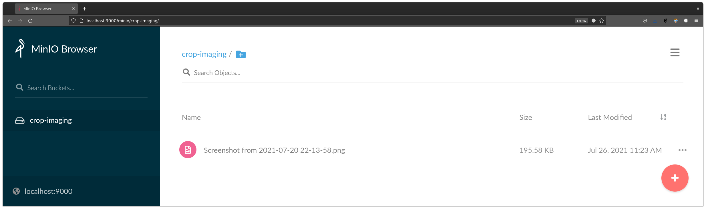
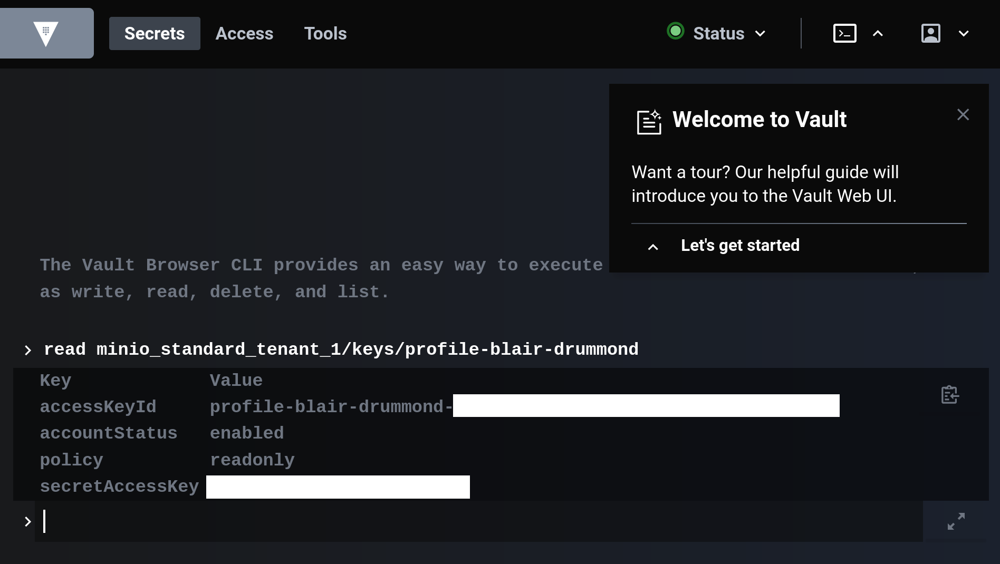

# Terraform Blob Storage setup for AD + MinIO IAM access control

Create a blob storage system with metadata and access control, and
sync it with an external MinIO system via IAM policies.

The FDI team says per-dataset who should be able to read and write,
like this

```terraform
    cropimaging = {

      kubeflow_readers = ["blair", "jim"]
      kubeflow_writers = ["blair"]

      division = "DScD"
      use_case = "crop imaging"
      contact_email = "blair.drummond@example.ca"
      cct_score = 0
    }
    frontiercounts = {

      kubeflow_readers = ["jim"]
      kubeflow_writers = []

      division = "CCTTS"
      use_case = "fc"
      contact_email = "blair.drummond@example.ca"
      cct_score = 5
    }

```

Then the `iam_policies.tf` code compiles this information to determine a single policy that defines what a user has access to (see below) 


```json
# This was autogenerated by terraform
➜  minio-fdi git:(master) ✗ mc admin policy info minio-local jim
{
  "Version": "2012-10-17",
  "Statement": [
    {
      "Effect": "Allow",
      "Action": [
        "s3:GetObject",
        "s3:ListAllMyBuckets",
        "s3:ListBucket"
      ],
      "Resource": [
        "arn:aws:s3:::cropimaging/*",
        "arn:aws:s3:::cropimaging"
      ]
    },
    {
      "Effect": "Allow",
      "Action": [
        "s3:GetObject",
        "s3:ListAllMyBuckets",
        "s3:ListBucket"
      ],
      "Resource": [
        "arn:aws:s3:::frontiercounts/*",
        "arn:aws:s3:::frontiercounts"
      ]
    }
  ]
}
```





## This requires the MinIO Terraform provider

https://github.com/aminueza/terraform-provider-minio/releases/tag/v1.2.0


# Integrations and TODO

Once users have a policy defined, we can create a vault role for them using the [`vault-minio-secrets-plugin`](https://github.com/StatCan/vault-plugin-secrets-minio). E.g.


```sh
vault write minio/roles/fdi-blair \
  policy=blair
  user_name_prefix=fdi-blair-
```

At which point you can use `vault` to get credentials dynamically


